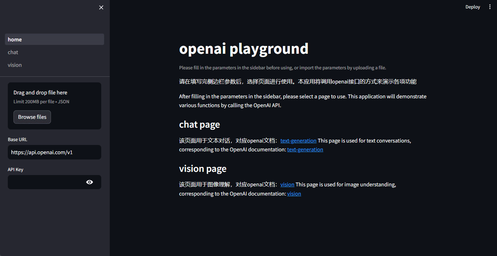

[English](./README_EN.md) | [中文](./README.md) |


[](https://chat-openai-app.streamlit.app/)


# chat-openai-streamlit
Web application for various models' dialogue based on the OpenAI API, written in Streamlit,assistants,speech to text

## 0. Objective

- [x] Support the Chat Completions API page for text conversations
- [x] Support the Vision page for image understanding
- [x] A page that supports Image generation for generating images
- [x] Assistants page
- [x] Support the page for language to text
- [x] Support the page for text to speech

Other added features

- [x] Display the time taken after each conversation on the chat page (controlled by the configuration file)
- [x] Display the number of tokens consumed after each conversation on the chat page (controlled by the configuration file)

## 1. Installation

```bash
pip install -r requirements.txt
```

## 2. Running

```bash
cd src
streamlit run chat.py --server.port 1234
```

## 3. Screenshots
The following screenshots may not be the latest. You can see the latest examples [here]().





## 4. Configuration File

The default parameter configuration file is located at `src/config/default.yaml`. Here are the custom parameters explained:
* models: The models displayed in the dropdown menu on the chat page
* num_tokens: Whether to display the number of tokens consumed after each conversation
* use_time: Whether to display the time taken after each conversation